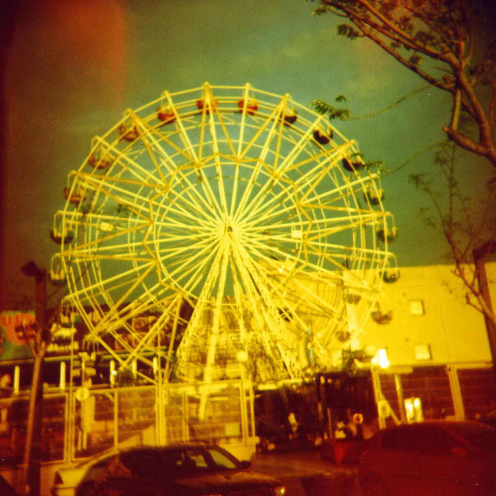
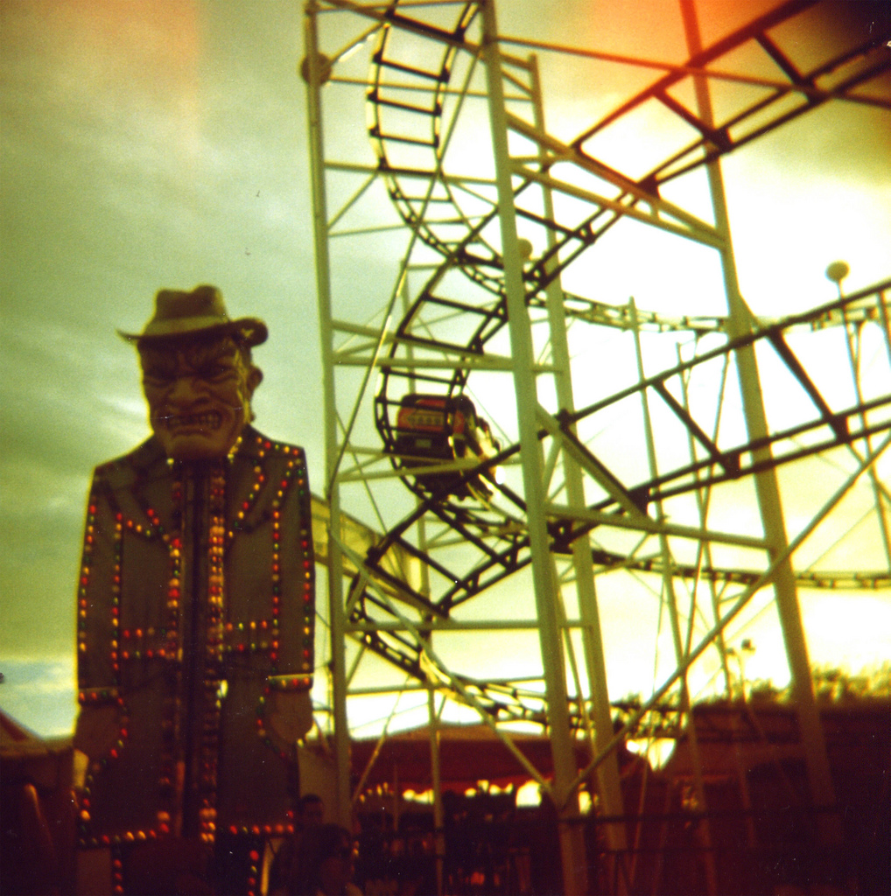

jquery.flickslide.js
====================
v 1.4  
Copyright (c) 2013 SHIFTBRAIN Inc.  
Licensed under the MIT license.  
https://github.com/devjam  

フリック入力にも対応したよくあるスライドショー  

## DEMO
http://devjam.github.com/jquery.flickslide.js/

---

## REQUIRE:
jquery.js

## ADDITIONAL:
jquery.easing.js  
util.js  
jquery.common.js  

---

## OPTION
- imagearea: '.imagearea'		:String("selector") or Jquery Object
- naviarea: '.naviarea'			:String("selector") or Jquery Object
- navibtn: '.navibtn'				:String("selector") or Jquery Object
- interval: 300							:Integer	Auto slide Interval. 0 is kill auto slide
- duration: 500							:Number 	duration of slide animete
- easing: "liner"						:String(jquery.easing.js)		easing of slide animete
- width: 0									:Integer	view area width. 0 is fit image width
- "min-width": 0						:Integer	view area min width
- resize: false							:Bool			window.bind "resize"

---

## USAGE
need  
slidearea: total container  
imagearea: image view area  
slidecontent: image container  
naviarea: navi container  
1 navibtn code  

## EVENT
slidestart(e, id)  

## method
.FlickSlide({config})  
.FlickSlide("init")  
.FlickSlide("update")  
.FlickSlide("resize")  
.FlickSlide("destory")  
.FlickSlide("setImage", [urls])  

### example:basic
>  html
>  `
>      
<!-- slidearea: total container -->  
>  	    
<!-- imagearea: image view area -->  
>  		    <ul class="slidecontent"><!-- slidecontent: image container -->  
>  			    <li></li>  
>  			    <li></li>  
>  			    <li></li>  
>  			    <li></li>  
>  			    <li></li>  
>  		    </ul>  
>  	    
<!-- /imagearea -->  
>  	    <ul class="naviarea"><!-- naviarea: navi container -->  
>  		    <li class="navibtn"></li><!--  
>  	    </ul>  
>      
<!-- /slidearea -->  
>  `
>  
>  JavaScript
>  `
>      $("#slidearea").FlickSlide({interval:500, resize:true, easing:"easeOutExpo"});  
>      $("#slidearea").FlickSlide("init");  
>  `

### example:replace image
>  JavaScript
>  `
>      $("#slidearea").FlickSlide({interval:500, resize:true, easing:"easeOutExpo"});  
>      $("#slidearea").FlickSlide("setImage", [  
>  	    "img/cut1.jpg",  
>  	    "img/cut2.jpg",  
>  	    "img/cut3.jpg",  
>  	    "img/cut4.jpg",  
>  	    "img/cut5.jpg",  
>      ]);  
>  `

---

## HISTORY
_2013.02.07 : v1.4_
- プラグインの構造を全面的に改定

_2012.12.27 : v1.2_
- 挙動のおかしな点を修正
- windowリサイズイベントが残らないような処理追加(未検証)

_2012.12.18 : v1.1_
- モリスライドからバージョンアップ
